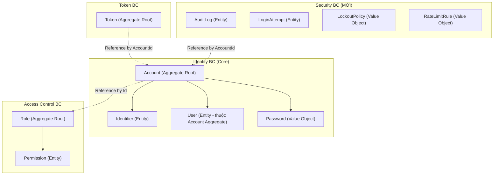
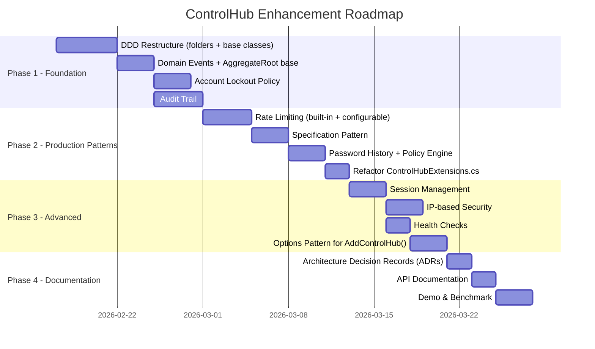

# 🏗️ ControlHub — Phân Tích Kiến Trúc & Hướng Phát Triển

> Tài liệu mentoring từ góc nhìn Senior Software Engineer
> **Mục tiêu**: Nâng ControlHub từ "auth library hoạt động được" → "production-grade auth platform" xứng đáng là đồ án tốt nghiệp xuất sắc và một kho pattern thực tế.

---

## 1. Đánh Giá Hiện Trạng (Assessment)

### ✅ Điểm Mạnh — Những Gì Em Đã Làm Đúng

| Khía cạnh | Đánh giá |
|---|---|
| **Library packaging** | `AddControlHub()` / `UseControlHub()` — pattern chuẩn NuGet, tách biệt host app và library rõ ràng |
| **CQRS + MediatR** | Tách Command/Query đúng pattern, có `ValidationBehavior` pipeline |
| **Result pattern** | Không throw exception cho business logic, dùng `Result<T>` nhất quán |
| **Factory Method** | Domain entities dùng private constructor + static factory method |
| **Value Objects** | `Password`, `Email`, `Identifier` — encapsulate validation logic |
| **UnitOfWork** | Transaction management có xử lý `SafeRollback`, `ConcurrencyException` mapping |
| **Outbox Pattern** | Asynchronous message processing cho email, đảm bảo eventual consistency |
| **Caching** | Decorator pattern: `CachedRoleRepository`, `CachedPermissionRepository`, `CachedIdentifierConfigRepository` |
| **AI Module** | AuditAI V1/V2.5/V3 với ONNX, RAG, Agentic Orchestration — rất ấn tượng cho đồ án |
| **Observability** | Serilog structured logging, OpenTelemetry tracing/metrics, Prometheus endpoint |
| **Real-time** | SignalR hub cho Dashboard, Active User tracking |
| **Embedded Dashboard** | React SPA served từ embedded resources — NuGet-friendly |

### ⚠️ Điểm Cần Cải Thiện

#### 1.1 Tổ Chức Thư Mục: Entity-Centric vs DDD Bounded Contexts

Hiện tại cấu trúc đang **tổ chức theo Entity**, không phải **Bounded Context** (BC):

```
Domain/
├── Accounts/      ← Entity folder
├── Permissions/   ← Entity folder
├── Roles/         ← Entity folder
├── Users/         ← Entity folder
├── Tokens/        ← Entity folder
└── OutBoxs/       ← Infrastructure concern lọt vào Domain!
```

> [!WARNING]
> `OutBoxs/` nằm trong Domain layer là vi phạm nghiêm trọng — Outbox là infrastructure/application concern, không phải domain knowledge.

#### 1.2 Domain Logic Còn "Anemic" Ở Một Số Chỗ

- `User` entity gần như là POCO: `SetUsername`, `UpdateProfile` chỉ set property, không có business rule
- `Account.Delete()` revoke tất cả token nhưng không raise **Domain Event**
- `Role.ClearPermissions()` xóa hết permission mà không validate — nguy hiểm trong production
- Không có **Aggregate Root boundary enforcement** — `User` có thể bị truy cập trực tiếp mà không qua `Account`

#### 1.3 Missing Patterns Quan Trọng

| Pattern | Tình trạng |
|---|---|
| Domain Events | ❌ Không có (chỉ có 1 `LoginAttemptedEvent` ở Application layer) |
| Specification Pattern | ❌ Không có — query logic nằm rải rác trong repositories |
| Rate Limiting | ❌ Không có — API endpoint mở hoàn toàn |
| Audit Trail | ❌ Không có audit log cho admin actions |
| Account Lockout | ❌ Không thấy logic lockout sau N lần login sai |
| IP Blocking | ❌ Không có |
| Session Management | ❌ Chỉ có token, không quản lý concurrent sessions |
| Password History | ❌ Không ngăn dùng lại password cũ |

#### 1.4 Code Quality Issues

- [ControlHubExtensions.cs](file:///E:/Project/ControlHub/src/ControlHub.Infrastructure/Extensions/ControlHubExtensions.cs#L372-L431): 60 dòng comment rác từ AI tool nằm trong Swagger config
- `ControlHubExtensions.cs` dài 534 dòng — nên tách thành nhiều extension methods nhỏ
- `OutBoxs` thư mục bị typo (nên là `Outbox`)

---

## 2. Restructure Theo DDD — Kế Hoạch Chi Tiết

### 2.1 Bounded Contexts Mapping



### 2.2 Cấu Trúc Thư Mục Đề Xuất

```
ControlHub.Domain/
├── Identity/                    ← Bounded Context: Identity
│   ├── Aggregates/
│   │   └── Account.cs          ← Aggregate Root
│   ├── Entities/
│   │   ├── Identifier.cs
│   │   └── User.cs             ← Thuộc Account Aggregate
│   ├── ValueObjects/
│   │   ├── Password.cs
│   │   └── Email.cs
│   ├── Enums/
│   │   ├── IdentifierType.cs
│   │   └── ValidationRuleType.cs
│   ├── Events/                  ← Domain Events
│   │   ├── AccountCreatedEvent.cs
│   │   ├── AccountLockedEvent.cs
│   │   ├── PasswordChangedEvent.cs
│   │   └── IdentifierAddedEvent.cs
│   ├── Services/
│   │   ├── IdentifierFactory.cs
│   │   └── DynamicIdentifierValidator.cs
│   ├── Rules/                   ← Business Rules / Specifications
│   │   ├── IIdentifierValidator.cs
│   │   └── PasswordPolicyRule.cs
│   └── Repositories/           ← Interface only
│       └── IAccountRepository.cs
│
├── AccessControl/               ← Bounded Context: Access Control
│   ├── Aggregates/
│   │   └── Role.cs
│   ├── Entities/
│   │   └── Permission.cs
│   ├── Events/
│   │   ├── RoleCreatedEvent.cs
│   │   └── PermissionAssignedEvent.cs
│   ├── Specifications/          ← Specification Pattern
│   │   ├── ActiveRolesSpec.cs
│   │   └── RoleHasPermissionSpec.cs
│   └── Repositories/
│       ├── IRoleRepository.cs
│       └── IPermissionRepository.cs
│
├── TokenManagement/             ← Bounded Context: Token
│   ├── Aggregates/
│   │   └── Token.cs
│   ├── Enums/
│   │   └── TokenType.cs
│   ├── Events/
│   │   └── TokenRevokedEvent.cs
│   └── Repositories/
│       └── ITokenRepository.cs
│
├── Security/                    ← Bounded Context MỚI: Security
│   ├── Entities/
│   │   ├── AuditEntry.cs
│   │   └── LoginAttempt.cs
│   ├── ValueObjects/
│   │   ├── LockoutPolicy.cs
│   │   └── IpAddress.cs
│   ├── Events/
│   │   ├── SuspiciousActivityDetectedEvent.cs
│   │   └── AccountLockedOutEvent.cs
│   └── Services/
│       └── ILockoutService.cs
│
└── SharedKernel/                ← Cross-cutting domain primitives
    ├── Entity.cs                ← Base class with Id, Equals
    ├── AggregateRoot.cs         ← Base class with Domain Events
    ├── ValueObject.cs
    ├── IDomainEvent.cs
    └── Result.cs
```

### 2.3 AggregateRoot Base Class (Cần Thêm)

Em hiện tại **chưa có** base class `AggregateRoot` với domain events. Đây là pattern cốt lõi của DDD:

```csharp
// SharedKernel/AggregateRoot.cs
public abstract class AggregateRoot
{
    private readonly List<IDomainEvent> _domainEvents = new();
    public IReadOnlyCollection<IDomainEvent> DomainEvents => _domainEvents.AsReadOnly();

    protected void RaiseDomainEvent(IDomainEvent domainEvent)
        => _domainEvents.Add(domainEvent);

    public void ClearDomainEvents()
        => _domainEvents.Clear();
}

// Account.cs — sau khi refactor
public class Account : AggregateRoot
{
    public void Delete()
    {
        IsDeleted = true;
        User?.Delete();
        foreach (var token in _tokens) token.Revoke();
        foreach (var ident in _identifiers) ident.Delete();

        // 🔥 Bây giờ có Domain Event!
        RaiseDomainEvent(new AccountDeletedEvent(Id));
    }
}
```

---

## 3. Các Vấn Đề Thực Tế Cần Triển Khai (Production Patterns)

### 🔴 Phase 1: Security Fundamentals (Ưu tiên cao nhất)

#### 3.1 Rate Limiting — Cả Internal và Configurable

Đây là pattern em hỏi và rất đúng hướng. Triển khai ở **2 tầng**:

**Tầng 1: Built-in Rate Limiting cho API của ControlHub**

```csharp
// Domain/Security/ValueObjects/RateLimitRule.cs
public class RateLimitRule : ValueObject
{
    public string Endpoint { get; }
    public int MaxRequests { get; }
    public TimeSpan Window { get; }
    public RateLimitStrategy Strategy { get; } // SlidingWindow, TokenBucket, FixedWindow

    // Factory methods cho các rule chuẩn
    public static RateLimitRule ForLogin() => new("login", 5, TimeSpan.FromMinutes(15), RateLimitStrategy.SlidingWindow);
    public static RateLimitRule ForPasswordReset() => new("password-reset", 3, TimeSpan.FromHours(1), RateLimitStrategy.FixedWindow);
    public static RateLimitRule ForApiGeneral() => new("api-general", 100, TimeSpan.FromMinutes(1), RateLimitStrategy.TokenBucket);
}
```

**Tầng 2: Configurable Rate Limiting cho Dev sử dụng ControlHub**

```csharp
// Trong AddControlHub() extension - cho phép dev config từ appsettings.json
services.AddControlHub(configuration, options =>
{
    options.RateLimiting.EnableForLogin(maxAttempts: 5, window: TimeSpan.FromMinutes(15));
    options.RateLimiting.EnableForApi(maxRequests: 100, window: TimeSpan.FromMinutes(1));
    options.RateLimiting.AddCustomRule("my-endpoint", 50, TimeSpan.FromMinutes(1));
});

// Hoặc từ appsettings.json:
// "ControlHub": {
//   "RateLimiting": {
//     "Login": { "MaxAttempts": 5, "WindowMinutes": 15 },
//     "Api": { "MaxRequests": 100, "WindowMinutes": 1 }
//   }
// }
```

> [!IMPORTANT]
> .NET 8 có built-in Rate Limiting middleware (`Microsoft.AspNetCore.RateLimiting`). Em nên wrap nó trong ControlHub API để cung cấp cấu hình dễ dàng, đồng thời cung cấp extension method `AddControlHubRateLimiting()` cho dev.

#### 3.2 Account Lockout Policy

```csharp
// Domain/Security/ValueObjects/LockoutPolicy.cs
public class LockoutPolicy : ValueObject
{
    public int MaxFailedAttempts { get; }       // Default: 5
    public TimeSpan LockoutDuration { get; }    // Default: 15 min
    public bool EnableProgressiveLockout { get; } // 15m → 30m → 1h → 24h

    // Domain logic ngay trong Value Object!
    public TimeSpan CalculateLockoutDuration(int consecutiveFailures)
    {
        if (!EnableProgressiveLockout) return LockoutDuration;
        var multiplier = Math.Pow(2, Math.Min(consecutiveFailures - MaxFailedAttempts, 4));
        return TimeSpan.FromMinutes(LockoutDuration.TotalMinutes * multiplier);
    }
}
```

Thêm vào `Account` aggregate:

```csharp
public class Account : AggregateRoot
{
    public int FailedLoginAttempts { get; private set; }
    public DateTime? LockedUntil { get; private set; }

    public Result RecordFailedLogin(LockoutPolicy policy)
    {
        FailedLoginAttempts++;
        if (FailedLoginAttempts >= policy.MaxFailedAttempts)
        {
            var duration = policy.CalculateLockoutDuration(FailedLoginAttempts);
            LockedUntil = DateTime.UtcNow.Add(duration);
            RaiseDomainEvent(new AccountLockedEvent(Id, LockedUntil.Value));
            return Result.Failure(AccountErrors.AccountLocked(LockedUntil.Value));
        }
        return Result.Success();
    }

    public Result RecordSuccessfulLogin()
    {
        FailedLoginAttempts = 0;
        LockedUntil = null;
        RaiseDomainEvent(new LoginSucceededEvent(Id));
        return Result.Success();
    }

    public bool IsLockedOut => LockedUntil.HasValue && LockedUntil.Value > DateTime.UtcNow;
}
```

#### 3.3 Audit Trail (Security Logging)

```csharp
// Domain/Security/Entities/AuditEntry.cs
public class AuditEntry
{
    public Guid Id { get; private set; }
    public Guid? AccountId { get; private set; }
    public string Action { get; private set; }       // "Login", "PasswordChanged", "RoleAssigned"
    public string Details { get; private set; }       // JSON serialized context
    public string IpAddress { get; private set; }
    public string UserAgent { get; private set; }
    public AuditSeverity Severity { get; private set; }
    public DateTime CreatedAt { get; private set; }

    public static AuditEntry Create(Guid? accountId, string action, string details,
        string ipAddress, AuditSeverity severity = AuditSeverity.Info)
    {
        return new AuditEntry { /* ... */ };
    }
}
```

> [!TIP]
> Audit Trail kết hợp với Outbox Pattern hiện có sẽ rất đẹp — ghi audit entry vào Outbox, process bất đồng bộ, không ảnh hưởng performance của request chính.

---

### 🟠 Phase 2: Design Patterns Nâng Cao (Business Logic Depth)

#### 3.4 Specification Pattern

Pattern này giúp encapsulate query logic vào Domain, thay vì rải rác trong Repository:

```csharp
// SharedKernel/Specifications/ISpecification.cs
public interface ISpecification<T>
{
    Expression<Func<T, bool>> ToExpression();
    bool IsSatisfiedBy(T entity);
}

// AccessControl/Specifications/ActiveRolesSpec.cs
public class ActiveRolesSpec : Specification<Role>
{
    public override Expression<Func<Role, bool>> ToExpression()
        => role => role.IsActive && !role.IsDeleted;
}

// Sử dụng:
var activeRoles = await _roleRepository.FindAsync(new ActiveRolesSpec());
```

#### 3.5 Policy Pattern cho Authorization

Hiện tại Authorization logic nằm trong `PermissionAuthorizationHandler`. Nâng cấp thành **Policy-based Authorization Engine**:

```csharp
// Domain/AccessControl/Policies/IAuthorizationPolicy.cs
public interface IAuthorizationPolicy
{
    string PolicyName { get; }
    Task<AuthorizationResult> EvaluateAsync(AuthorizationContext context);
}

// Ví dụ: Time-based access
public class BusinessHoursPolicy : IAuthorizationPolicy
{
    public string PolicyName => "BusinessHoursOnly";

    public Task<AuthorizationResult> EvaluateAsync(AuthorizationContext context)
    {
        var now = DateTime.UtcNow;
        var isBusinessHours = now.Hour >= 8 && now.Hour <= 18 && now.DayOfWeek != DayOfWeek.Sunday;
        return Task.FromResult(isBusinessHours
            ? AuthorizationResult.Success()
            : AuthorizationResult.Failure("Access restricted to business hours"));
    }
}
```

#### 3.6 Domain Events + Event-Driven Architecture

Bổ sung dispatcher trong `UnitOfWork`:

```csharp
// Infrastructure/Persistence/UnitOfWork.cs — nâng cấp
public async Task<int> CommitAsync(CancellationToken ct = default)
{
    // Publish Domain Events TRƯỚC KHI commit
    await DispatchDomainEventsAsync();
    // ... existing commit logic
}

private async Task DispatchDomainEventsAsync()
{
    var aggregateRoots = _dbContext.ChangeTracker
        .Entries<AggregateRoot>()
        .Where(e => e.Entity.DomainEvents.Any())
        .Select(e => e.Entity)
        .ToList();

    var domainEvents = aggregateRoots
        .SelectMany(a => a.DomainEvents)
        .ToList();

    aggregateRoots.ForEach(a => a.ClearDomainEvents());

    foreach (var domainEvent in domainEvents)
    {
        await _mediator.Publish(domainEvent);
    }
}
```

#### 3.7 Password History & Password Policy Engine

```csharp
// Domain/Identity/ValueObjects/PasswordPolicy.cs
public class PasswordPolicy : ValueObject
{
    public int MinLength { get; }
    public bool RequireUppercase { get; }
    public bool RequireLowercase { get; }
    public bool RequireDigit { get; }
    public bool RequireSpecialChar { get; }
    public int PasswordHistoryCount { get; }    // Không cho dùng lại N password gần nhất
    public int MaxAgeDays { get; }              // Bắt đổi password sau N ngày

    public Result Validate(string rawPassword) { /* ... */ }
}
```

---

### 🟡 Phase 3: Production Hardening (Thực Tế Vận Hành)

#### 3.8 Circuit Breaker cho External Services

Em đã có `ICircuitBreaker` trong AI module. Mở rộng pattern này sang:
- **Email Service** — SMTP server down → fallback queue
- **Database** — Connection pool exhausted → graceful degradation

#### 3.9 Health Checks

```csharp
// Trong AddControlHub()
services.AddHealthChecks()
    .AddDbContextCheck<AppDbContext>("database")
    .AddCheck<SmtpHealthCheck>("email-service")
    .AddCheck<TokenServiceHealthCheck>("token-service");
```

#### 3.10 Multi-Tenant Support (Stretch Goal)

Nếu muốn ControlHub hỗ trợ nhiều app khác nhau dùng chung 1 instance:

```csharp
// Schema isolation per tenant
services.AddControlHub(configuration, options =>
{
    options.MultiTenancy.Enable();
    options.MultiTenancy.Strategy = TenantStrategy.SchemaPerTenant;
    // Hoặc: TenantStrategy.DatabasePerTenant
    // Hoặc: TenantStrategy.SharedWithDiscriminator
});
```

#### 3.11 Options Pattern cho ControlHub Configuration

Tái cấu trúc `AddControlHub()` (hiện đang 350+ dòng) thành modular:

```csharp
// API sạch hơn cho developer
services.AddControlHub(configuration, options =>
{
    options.UseDatabase(db => db.UseSqlServer(connectionString));
    options.UseAuthentication(auth =>
    {
        auth.TokenLifetime = TimeSpan.FromHours(1);
        auth.RefreshTokenLifetime = TimeSpan.FromDays(7);
    });
    options.UseRateLimiting(rate =>
    {
        rate.ForLogin(5, TimeSpan.FromMinutes(15));
        rate.ForApi(100, TimeSpan.FromMinutes(1));
    });
    options.UseAuditTrail();
    options.UseAccountLockout(lockout =>
    {
        lockout.MaxAttempts = 5;
        lockout.Duration = TimeSpan.FromMinutes(15);
        lockout.Progressive = true;
    });
});
```

---

## 4. Tái Cấu Trúc `ControlHubExtensions.cs`

File này hiện đang quá lớn (534 LOC). Tách thành:

```
Infrastructure/Extensions/
├── ControlHubExtensions.cs              ← Entry point: AddControlHub() chỉ gọi các sub-extensions
├── DatabaseExtensions.cs                ← AddControlHubDatabase()
├── AuthenticationExtensions.cs          ← AddControlHubAuthentication()
├── AuthorizationExtensions.cs           ← AddControlHubAuthorization()
├── RepositoryExtensions.cs              ← AddControlHubRepositories()
├── AIExtensions.cs                      ← AddControlHubAI()
├── RealTimeExtensions.cs                ← AddControlHubRealTime()
├── SwaggerExtensions.cs                 ← AddControlHubSwagger()
└── GuiExtensions.cs                     ← UseControlHubGui()
```

---

## 5. Roadmap Phát Triển Theo Giai Đoạn



---

## 6. Tổng Kết — Quy Tắc Vàng Cho Backend Engineer

### Mindset Shift: Entity-Centric → Behavior-Centric

| Trước (Entity-Centric) | Sau (Behavior-Centric / DDD) |
|---|---|
| "Account có những field gì?" | "Account có thể làm gì? Các business rule nào apply?" |
| Repository chứa query logic | Specification chứa query logic, Repository chỉ execute |
| Service layer chứa tất cả logic | Domain entities chứa business rules, Service chỉ orchestrate |
| Flat error handling | Rich domain errors với context |
| Direct entity access | Access thông qua Aggregate Root boundary |

### Checklist Cho Giảng Viên Đánh Giá Cao

- [x] CQRS + MediatR pattern
- [x] Result pattern (không throw)
- [x] Value Objects
- [x] Factory Method
- [x] Outbox Pattern
- [x] Caching Decorator
- [x] Library packaging pattern
- [ ] **Domain Events ← Cần thêm**
- [ ] **Specification Pattern ← Cần thêm**
- [ ] **Rate Limiting ← Cần thêm**
- [ ] **Audit Trail ← Cần thêm**
- [ ] **Account Lockout ← Cần thêm**
- [ ] **DDD Bounded Contexts ← Cần restructure**
- [ ] **AggregateRoot base class ← Cần thêm**
- [ ] **Architecture Decision Records ← Document why, not just how**

> [!IMPORTANT]
> **Lời khuyên quan trọng nhất**: Đừng chỉ implement pattern — hãy **viết ADR (Architecture Decision Record)** cho mỗi pattern giải thích **TẠI SAO** em chọn pattern đó. Giảng viên đánh giá cao người hiểu **trade-off**, không phải người biết nhiều pattern nhất.

---

*Tài liệu được tạo dựa trên phân tích source code trực tiếp từ project ControlHub.*
