# ControlHub Domain Layer — Class Diagram

Generated: 2026-03-10

```mermaid
classDiagram
    %% ─── Shared Kernel ───────────────────────────────────────────────
    class AggregateRoot {
        <<abstract>>
        +IReadOnlyCollection~IDomainEvent~ DomainEvents
        #RaiseDomainEvent(IDomainEvent) void
        +ClearDomainEvents() void
    }

    class ValueObject {
        <<abstract>>
        #GetEqualityComponents()* IEnumerable~object~
        +Equals(object?) bool
        +GetHashCode() int
    }

    class IDomainEvent {
        <<interface>>
        +DateTime OccurredOn
    }

    %% ─── AccessControl ───────────────────────────────────────────────
    class Role {
        +Guid Id
        +string Name
        +string Description
        +bool IsActive
        +bool IsDeleted
        +IReadOnlyCollection~Permission~ Permissions
        +Create(Guid, string, string)$ Role
        +Update(string, string) Result
        +AddPermission(Permission) Result
        +AddRangePermission(IEnumerable~Permission~) Result~PartialResult~
        +ClearPermissions() void
        +Activate() void
        +Deactivate() void
        +Delete() void
    }

    class Permission {
        +Guid Id
        +string Code
        +string Description
        +Create(Guid, string, string)$ Result~Permission~
        +Update(string, string) Result
    }

    class AssignPermissionsService {
        +Handle(Role, IEnumerable~Permission~) Result
    }

    class CreateRoleWithPermissionsService {
        -AssignPermissionsService _service
        +Handle(string, string, IEnumerable~Permission~) Result~Role~
    }

    class RoleCreatedEvent {
        <<sealed record>>
        +Guid RoleId
        +DateTime OccurredOn
    }

    class RoleDeletedEvent {
        <<sealed record>>
        +Guid RoleId
        +DateTime OccurredOn
    }

    class RolePermissionChangedEvent {
        <<sealed record>>
        +Guid RoleId
        +DateTime OccurredOn
    }

    %% ─── Identity ────────────────────────────────────────────────────
    class Account {
        +Guid Id
        +Password Password
        +bool IsActive
        +bool IsDeleted
        +Guid RoleId
        +Role? Role
        +User? User
        +IReadOnlyCollection~Identifier~ Identifiers
        +IReadOnlyCollection~Token~ Tokens
        +Create(Guid, Password, Guid)$ Account
        +AddIdentifier(Identifier) Result
        +RemoveIdentifier(IdentifierType, string) Result
        +AttachUser(User) Result
        +AttachRole(Role) Result
        +AddToken(Token) void
        +Activate() void
        +Deactivate() void
        +Delete() void
        +UpdatePassword(Password) Result
    }

    class User {
        +Guid Id
        +string? Username
        +string? FirstName
        +string? LastName
        +string? PhoneNumber
        +bool IsDeleted
        +Guid AccId
        +Delete() void
        +SetUsername(string?) void
        +UpdateUsername(string) Result
        +UpdateProfile(string?, string?, string?) void
    }

    class Email {
        <<sealed>>
        +string Value
        +Create(string)$ Result~Email~
        +UnsafeCreate(string)$ Email
        +Equals(Email?) bool
        +ToString() string
    }

    class Password {
        <<sealed>>
        +byte[] Hash
        +byte[] Salt
        +From(byte[], byte[])$ Password
        +Create(string, IPasswordHasher)$ Result~Password~
        +IsWeak(string)$ bool
        +IsValid() bool
        #GetEqualityComponents() IEnumerable~object~
    }

    class Identifier {
        <<sealed>>
        +IdentifierType Type
        +string Name
        +string Value
        +string NormalizedValue
        +string Regex
        +bool IsDeleted
        +Create(IdentifierType, string, string)$ Identifier
        +CreateWithName(IdentifierType, string, string, string)$ Identifier
        +UpdateNormalizedValue(string) Result~Identifier~
        +Delete() void
        #GetEqualityComponents() IEnumerable~object~
    }

    class IdentifierType {
        <<enumeration>>
        Email = 0
        Phone = 1
        Username = 2
        Custom = 99
    }

    %% ─── Identifiers / Config ────────────────────────────────────────
    class IdentifierConfig {
        +Guid Id
        +string Name
        +string Description
        +bool IsActive
        +DateTime CreatedAt
        +DateTime? UpdatedAt
        +IReadOnlyCollection~ValidationRule~ Rules
        +Create(string, string)$ IdentifierConfig
        +AddRule(ValidationRuleType, Dictionary~string,object~) Result
        +RemoveRule(Guid) Result
        +Activate() void
        +Deactivate() void
        +UpdateName(string) void
        +UpdateDescription(string) void
        +UpdateRules(List~ValidationRule~) void
    }

    class ValidationRule {
        +Guid Id
        +ValidationRuleType Type
        +string ParametersJson
        +string? ErrorMessage
        +int Order
        +Create(ValidationRuleType, Dictionary~string,object~, string?, int)$ Result~ValidationRule~
        +GetParameters() Dictionary~string,object~
    }

    class ValidationRuleType {
        <<enumeration>>
        Required = 1
        MinLength = 2
        MaxLength = 3
        Pattern = 4
        Custom = 5
        Range = 6
        Email = 7
        Phone = 8
    }

    %% ─── Identifier Validators ───────────────────────────────────────
    class IIdentifierValidator {
        <<interface>>
        +IdentifierType Type
        +ValidateAndNormalize(string) (bool, string, Error?)
    }

    class EmailIdentifierValidator {
        +IdentifierType Type
        +ValidateAndNormalize(string) (bool, string, Error?)
    }

    class PhoneIdentifierValidator {
        +IdentifierType Type
        +ValidateAndNormalize(string) (bool, string, Error?)
    }

    class UsernameIdentifierValidator {
        +IdentifierType Type
        +ValidateAndNormalize(string) (bool, string, Error?)
    }

    class CustomIdentifierValidator {
        -IdentifierValidationBuilder _builder
        +IdentifierType Type
        +ValidateAndNormalize(string) (bool, string, Error?)
    }

    class IdentifierValidationBuilder {
        -List~Func~ _rules
        -Func~string,string~? _normalizer
        +Required(string?) IdentifierValidationBuilder
        +Length(int, int) IdentifierValidationBuilder
        +Pattern(string, RegexOptions) IdentifierValidationBuilder
        +Custom(Func, string) IdentifierValidationBuilder
        +Normalize(Func~string,string~) IdentifierValidationBuilder
        +Build() CustomIdentifierValidator
        +Validate(string) Result
    }

    class IdentifierFactory {
        -IEnumerable~IIdentifierValidator~ _validators
        -IIdentifierConfigRepository _repo
        -DynamicIdentifierValidator _dynamicValidator
        +CreateAsync(IdentifierType, string, Guid?, CancellationToken) Task~Result~Identifier~~
        +Create(IdentifierType, string, Guid?) Result~Identifier~
    }

    class DynamicIdentifierValidator {
        +ValidateAndNormalize(string, IdentifierConfig) Result~string~
    }

    class IIdentifierConfigRepository {
        <<interface>>
        +GetByIdAsync(Guid, CancellationToken) Task~Result~IdentifierConfig~~
        +GetByNameAsync(string, CancellationToken) Task~Result~IdentifierConfig~~
        +GetActiveConfigsAsync(CancellationToken) Task~Result~IEnumerable~IdentifierConfig~~~
        +AddAsync(IdentifierConfig, CancellationToken) Task~Result~
    }

    class IPasswordHasher {
        <<interface>>
        +Hash(string) Password
        +Verify(string, Password) bool
    }

    %% ─── TokenManagement ─────────────────────────────────────────────
    class Token {
        +Guid Id
        +Guid AccountId
        +string Value
        +TokenType Type
        +DateTime ExpiredAt
        +bool IsUsed
        +DateTime CreatedAt
        +bool IsRevoked
        +Create(Guid, string, TokenType, DateTime)$ Token
        +Rehydrate(Guid, Guid, string, TokenType, DateTime, bool, bool, DateTime)$ Token
        +MarkAsUsed() Result
        +IsValid() bool
        +Revoke() Result
    }

    class TokenType {
        <<enumeration>>
        ResetPassword = 1
        VerifyEmail = 2
        RefreshToken = 3
        AccessToken = 4
        RegisterUser = 5
    }

    %% ─── Inheritance ─────────────────────────────────────────────────
    AggregateRoot <|-- Role
    AggregateRoot <|-- Account
    AggregateRoot <|-- Token
    ValueObject <|-- Password
    ValueObject <|-- Identifier

    %% ─── AccessControl relationships ─────────────────────────────────
    Role "1" *-- "many" Permission : owns
    Role ..> RoleCreatedEvent : raises
    Role ..> RoleDeletedEvent : raises
    Role ..> RolePermissionChangedEvent : raises
    IDomainEvent <|.. RoleCreatedEvent
    IDomainEvent <|.. RoleDeletedEvent
    IDomainEvent <|.. RolePermissionChangedEvent
    CreateRoleWithPermissionsService --> AssignPermissionsService

    %% ─── Identity relationships ──────────────────────────────────────
    Account "1" *-- "many" Identifier : owns
    Account "1" *-- "many" Token : owns
    Account --> Role : RoleId FK
    Account --> User : has one
    Account --> Password : has
    User --> Account : AccId FK
    Token --> Account : AccountId FK

    %% ─── Identifier Config ───────────────────────────────────────────
    IdentifierConfig "1" *-- "many" ValidationRule : owns
    ValidationRule --> ValidationRuleType

    %% ─── Validator strategy ──────────────────────────────────────────
    IIdentifierValidator <|.. EmailIdentifierValidator
    IIdentifierValidator <|.. PhoneIdentifierValidator
    IIdentifierValidator <|.. UsernameIdentifierValidator
    IIdentifierValidator <|.. CustomIdentifierValidator
    CustomIdentifierValidator --> IdentifierValidationBuilder
    IdentifierFactory --> IIdentifierValidator
    IdentifierFactory --> IIdentifierConfigRepository
    IdentifierFactory --> DynamicIdentifierValidator
    DynamicIdentifierValidator --> IdentifierConfig

    %% ─── Enum usage ──────────────────────────────────────────────────
    Identifier --> IdentifierType
    Token --> TokenType
```

## Bounded Contexts Summary

| Bounded Context | Aggregates | Entities | Value Objects | Enums |
|---|---|---|---|---|
| AccessControl | `Role` | `Permission` | — | — |
| Identity | `Account` | `User`, `IdentifierConfig`, `ValidationRule` | `Email`, `Password`, `Identifier` | `IdentifierType`, `ValidationRuleType` |
| TokenManagement | `Token` | — | — | `TokenType` |

## Design Patterns

| Pattern | Classes |
|---|---|
| Aggregate Root | `Account`, `Role`, `Token` |
| Value Object | `Password`, `Identifier`, `Email` |
| Strategy | `IIdentifierValidator` + 4 implementations |
| Builder | `IdentifierValidationBuilder` |
| Factory | `IdentifierFactory`, static `Create()` on all aggregates |
| Domain Events | `RoleCreatedEvent`, `RoleDeletedEvent`, `RolePermissionChangedEvent` |
| Result Monad | All mutation methods return `Result` / `Result<T>` |
